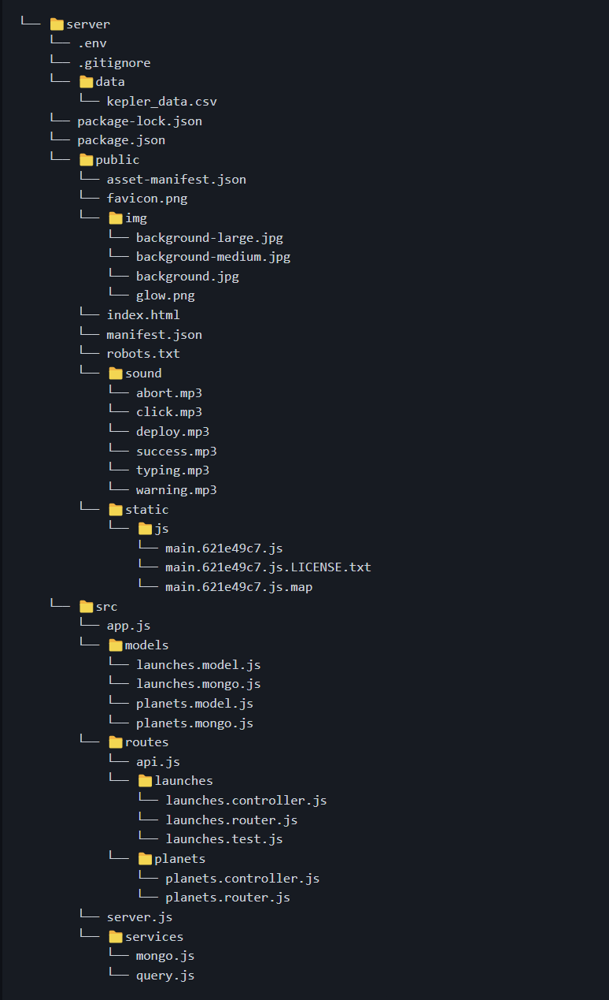

# Space Exploration Full Stack Application

## Overview:

This full-stack CRUD application is a 

The tools I've used are: Node/Express, MongoDB + Mongoose, React, nodemon, cors, axios, Morgan logger middleware, Jest, SuperTest library, Postman, dotenv package for secrets.

A high-level overview of my app's architecture (done in Figma).

This application is a continuation of my Exoplanets Parser in Express which you can find here: https://github.com/TankEngine-ish/Exoplanets_Explorer 

The API of this application also talks with an open source REST API for SpaceX's data in order to populate the list of historical rocket launches in my application. By the time this project was finished the SpaceX's API was on v5.

### Folder Structure:

## Personal notes:

* It's worth noting the three different package.json files. One for the client-side, one for the backend and one at the root of the folder. The root json has scripts for running the server and the client + installing dependencies.

* There are different ports for the backend and front-end. We use env variable. For the purpose of separation of concerns server.js has no express code, it just sets-up the http server. 

* We've got 4 main functions on the front-end - get planets, get launches, submit launches, abort launches (once API is ready)

* The CORS middleware to allow access from PORT: 3000 which is our front-end.

* First time I had to delve deep into unit and component testing including the many different stages they can be crucially important.

* There's always a controller for a router. Planets router calls functions in our planets controller. And our controller is only used by our router. We can have many models used by a single controller and a single model that is used in many different routes/controllers. We separate models because the data doesnt always match up with the collections, API endpoints and overall functionality that our API needs to support through our controllers and routes.

* I also got introduced to referential integrity when designing the schema and the difficulty of implementing an auto-increment feature the same way it's in a SQL database.

* It may be obvious but GET requests don't allow you to pass data in the body of the request. Instead, some API's use POST for search queries.

* I learned about ObjectId which are 12-byte identifier that MongoDB uses as the default value for the _id field in a document. It serves as a unique identifier for each document in a collection.
This ensures that each document has a unique identity within its collection and facilitates efficient querying and indexing.

There's also the "__v" field which is often used by Mongoose. It stands for "version" and is used for document versioning.
You can see what I mean in this screenshot of a test query.

* Where do we draw the line between the model and the controller? We dont want our controllers worrying about how the data in the model from the MVC pattern is stored. Ideally we want the controllers focusing on working with our request and response and our models can give us data access functions which control how the data in the model can be written to and read. Our model only really works directly with the data. Our controller only ever uses functions to work with the data model in order to put it all together into a useful response to our front-end client.

* Pagination of data and the amount of work it saves for the server is immense. We add pagination when we want to avoid sending too much data from our API when less data is just enough. The SpaceX's API is paginated and I was experimenting with extracting specific pages from its data before I switched it off permanently as I needed to populate my server with every single one of their launches.

* The Jest tests actually talk to my real-life database I set-up so they kind of resemble an end-to-end testing scenario.

* Rotating credentials is a method that is used when you or someone from your team accidentally leaks the secrets on the version control system for the public eye.

* I got introduced to versioning my API and how to do it properly. The below screenshot is from testing my v1 in Postman.

